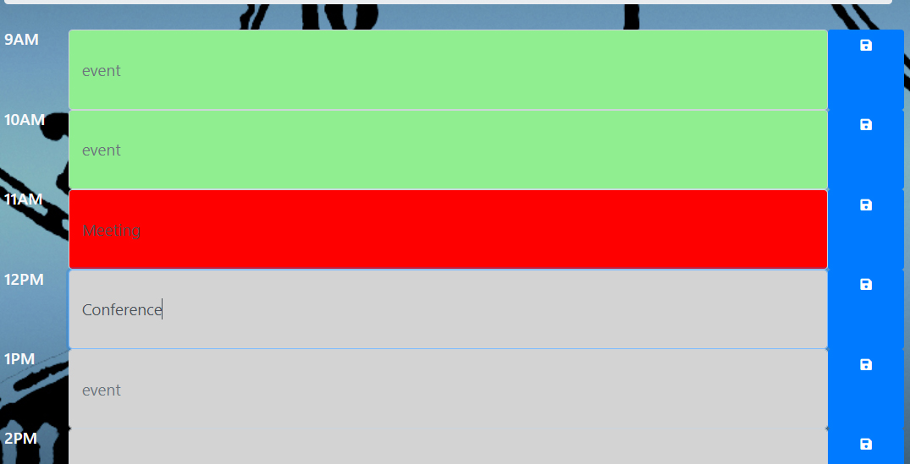

# Work Day Scheduler

A simple calendar application that allows the user to save events for each hour of the day. This app runs in the browser and features dynamically updated HTML and CSS powered by JavaScript and jQuery.




## 
```
When you open the app, you are presented with timeblocks for standard business hours. 
Each timeblock is color coded to indicate whether it is in the past, present, or future.
When you click into a timeblock you can enter an event.
When you click the save button for that timeblock, the text for that event is saved in local storage.
When you refresh the page, the saved events persist.

```

## Built with: 

- HTML
- CSS
- Bootstrap
- Moment.js
- JavaScript
- jQuery

### Deployment: https://jaliov.github.io/Word-Day-Scheduler/


